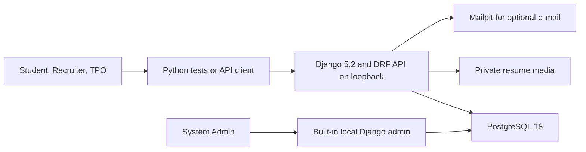

# CampusHire placement portal

CampusHire specifies a Python Django REST backend for a college Training and Placement Office. Students demonstrate it with Python tests or an API client; no student-built frontend is in scope, including optional work. This repository contains specifications, not application code.

## Quick facts

| Item | Value |
|---|---|
| Track | Python — Backend Web Development and DevOps |
| Difficulty | ★★★★☆ Upper-intermediate |
| Duration | 6 weeks, about 180 hours |
| Target job roles | Python Backend Developer, Django Developer, API Developer |
| Key skills | Django, DRF, PostgreSQL, SQL, REST, sessions, CSRF, Docker, CI |
| Prerequisites | Basic Python, basic SQL, Git basics, willingness to learn HTTP |
| Minimum hardware | 8 GB RAM laptop using the lite profile |
| Student repository name | `campushire` |

## What you will build

- Role-protected REST operations for students, recruiters, TPO staff, and admins.
- Student registration restricted to `sitm.example.in`.
- Student profiles with academics, skills, links, TPO verification, and safe PDF resume upload.
- Recruiter company profiles and job postings with TPO approval.
- An eligibility engine that shows all reason codes before a student applies.
- An application pipeline with timeline events and authorized resume download.
- Student job search with filters, pagination, sorting, and eligibility-only mode.
- TPO JSON/CSV reporting endpoints with placement metrics and SQL query-plan evidence.
- At least 55 meaningful Python tests, including API integration flows and local lifecycle acceptance.

Local startup, stop, seed data, loopback ports, and offline-after-download verification are specified in [06 Tech stack and setup](docs/06-tech-stack-and-setup.md). Django admin is a built-in local master-data tool, not a student-built business interface. No public deployment or paid account is required.

## Architecture at a glance

## How to read this specification

Read documents 01 to 04 first. Then read the architecture, setup, data model, API, testing, and delivery documents. `MUST` means mandatory. `SHOULD` means recommended after the MVP. `MAY` means optional stretch work. User stories use `US-NN`. Functional requirements use `FR-AREA-NN`. Business rules use `BR-NN`. Non-functional requirements use `NFR-CAT-NN`.

## Document index

| Document | Purpose |
|---|---|
| [01 Project overview](docs/01-project-overview.md) | Business goal, scope, assumptions, and success criteria. |
| [02 Users and roles](docs/02-users-and-roles.md) | Roles, permissions, personas, journeys, and stories. |
| [03 Functional requirements](docs/03-functional-requirements.md) | Features, business rules, states, validation, and errors. |
| [04 Non-functional requirements](docs/04-non-functional-requirements.md) | Performance, security, reliability, privacy, and quality targets. |
| [05 System architecture](docs/05-system-architecture.md) | Components, flows, deployment view, repository tree, and ADRs. |
| [06 Tech stack and setup](docs/06-tech-stack-and-setup.md) | Versions, tools, local setup, hardware profiles, and learning order. |
| [07 Data model](docs/07-data-model.md) | Entities, relationships, indexes, enumerations, and sample data. |
| [08 API specification](docs/08-api-specification.md) | REST endpoints, request and response examples, and JSON/CSV reports. |
| [09 Testing strategy and test cases](docs/09-testing-strategy-and-test-cases.md) | Test strategy, coverage, catalog, and traceability. |
| [10 DevOps, CI/CD, and quality](docs/10-devops-ci-cd-and-quality.md) | Git workflow, quality gates, Docker, CI, config, and DoD. |
| [11 Milestones and deliverables](docs/11-milestones-and-deliverables.md) | Six-week plan, effort budget, Gantt chart, and demo script. |
| [12 Evaluation rubric](docs/12-evaluation-rubric.md) | Mandatory gates, weighted grading, bonus, deductions, and viva. |
| [13 Interview preparation](docs/13-interview-preparation.md) | STAR pitch, interview questions, fundamentals, and profile tips. |
| [14 Glossary and resources](docs/14-glossary-and-resources.md) | Terms, official links, free resources, and reading order. |

## Rules for students

### Individual work

You must implement CampusHire yourself in your own public repository. You may discuss concepts with classmates. You must not copy code, data, or pull requests from another student.

### AI assistant policy

> You MAY use AI assistants (for example GitHub Copilot or ChatGPT) to learn concepts, explain errors, and review your code. You MUST understand every line that you commit. You MUST tell the trainer about significant AI help in the pull request description. You MUST NOT give this specification to an AI tool and submit the generated solution as your own work. In the viva, the trainer asks you to explain and change your code live. If you cannot explain your code, the result is "Rework required".

### How to ask questions

> Open a GitHub Issue in this specification repository. Start the title with `[Question]`. The trainer answers in the issue, so all students can see the answer. If the answer changes the specification, the trainer updates the change log.

### Student repository

> Create a public repository with the name `campushire` in your own GitHub account. Add the trainer (`@sukurcf`) as a collaborator. Do not copy this specification into your repository. Link to it from your README.

### Review model

> Every change goes through a pull request. You MAY merge your own pull request after CI is green and you complete the PR checklist. The trainer reviews at least 2 substantive pull requests from each student every week. The trainer can ask for changes at any time.

### Requirement freeze

> This specification is frozen for the cohort. The trainer can add clarifications. If a change affects grading, the change log states the impact.

### Weekly demo

Every Friday, show a 15-minute demo to the trainer. Show the latest merged features, current CI status, and blockers.

## Change log

| Version | Date | Change |
|---|---|---|
| 1.0 | 2026-10-02 | First release |
| 1.1 | 2026-10-02 | Backend-only revision: frontend and public deployment deliverables removed. Their effort and points now assess Python, SQL, API contracts, tests, and reproducible local operations; six weeks and rubric weights are unchanged. |
