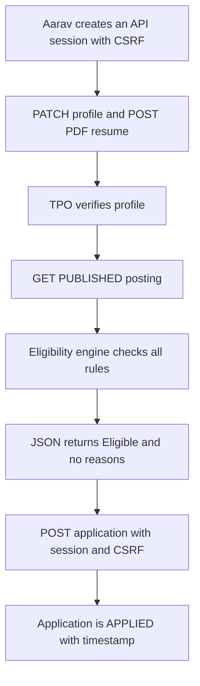
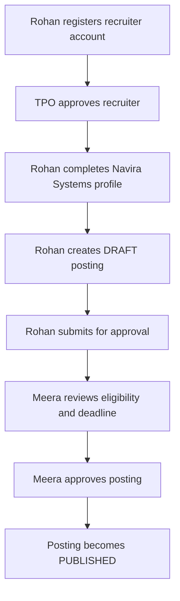
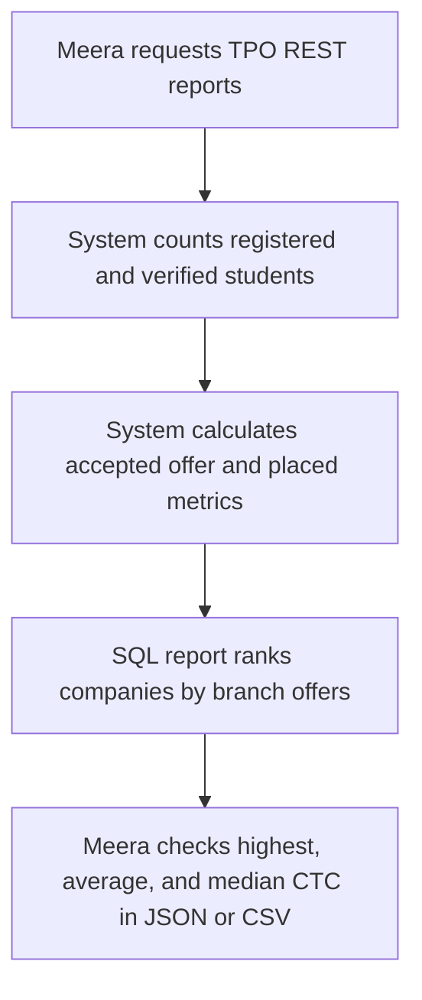

# Users and roles

Purpose: This document defines CampusHire users, permissions, journeys, and user stories.

## Roles

| Role | Description | Account creation |
|---|---|---|
| Student | A final-year or pre-final-year student who maintains a profile and applies to postings. | Self-registers with `@sitm.example.in`. |
| Recruiter | A company HR user who manages company data and reviews applicants. | Registers, then waits for TPO approval. |
| Placement Officer | TPO staff member who verifies profiles, approves postings, and reads REST reports. | Created by System Admin. |
| System Admin | Django admin user who manages settings, branches, skills, and TPO accounts. | Created through Django superuser flow. |

## Personas

| Persona | Role | Goals | Pain points | Technical comfort |
|---|---|---|---|---|
| Aarav Rao | Student, CSE 2027 | Apply before deadlines and understand eligibility. | Does not know why Google Forms reject him. | Can submit requests using an API client. |
| Meera Nair | Placement Officer | Verify student profiles and publish approved drives. | Tracks CGPA corrections across many sheets. | Can inspect JSON responses and CSV exports. |
| Rohan Bedi | Recruiter at Navira Systems | Collect eligible applicants for a Bengaluru role. | Receives mixed resumes from many branches. | Can use applicant query parameters. |
| Kavya Menon | System Admin | Keep college settings accurate. | Wants minimal data fixes during drives. | Comfortable with Django admin. |

## Permission matrix

| Action | Student | Recruiter | Placement Officer | System Admin |
|---|---|---|---|---|
| Register with college e-mail | Yes | No | No | No |
| Register as recruiter | No | Yes | No | No |
| Approve recruiter | No | No | Yes | Yes |
| Login and logout | Yes | Yes, including pending approval | Yes | Yes |
| Edit own student profile | Yes | No | No | No |
| Verify student profile | No | No | Yes | Yes |
| Upload own resume | Yes | No | No | No |
| Download applicant resume | Own applications only | Own postings only | All postings | Yes |
| Create company profile | No | Yes | No | No |
| Create posting | No | Yes for own company | No | No |
| Submit posting for approval | No | Yes | No | No |
| Approve or reject posting | No | No | Yes | Yes |
| Search published jobs | Yes | No | Yes | Yes |
| Apply to posting | Yes | No | No | No |
| Withdraw application before shortlist | Yes | No | No | No |
| Update application status | No | One application at a time | No | No |
| Read TPO JSON/CSV reports | No | No | Yes | Yes |
| Manage branches and skills | No | No | No | Yes |

## Key user journeys

### Student applies to an eligible posting

### Recruiter publishes a campus drive

### TPO reviews placement performance

## User stories

| ID | Story | Priority | Linked FR IDs |
|---|---|---|---|
| US-01 | As a student, I want to register with my college e-mail and log out safely, so that only college students use the portal. | Must | FR-AUTH-01 |
| US-02 | As a recruiter, I want to log in and see my pending approval status, so that I know when the TPO unlocks company access. | Must | FR-AUTH-02 |
| US-03 | As a student, I want to complete my academic profile and upload a valid PDF resume, so that recruiters see verified data. | Must | FR-PROFILE-01, FR-PROFILE-02 |
| US-04 | As a recruiter, I want to maintain my company profile and submit postings, so that students can apply to current drives. | Must | FR-POST-01, FR-POST-02 |
| US-05 | As a placement officer, I want to approve postings with rejection reasons, so that invalid drives are not published. | Must | FR-POST-02 |
| US-06 | As a student, I want to see every eligibility reason, so that I know what blocks my application. | Must | FR-ELIG-01 |
| US-07 | As a student, I want to apply once and withdraw before shortlisting, so that my application record stays correct. | Must | FR-APP-01 |
| US-08 | As a recruiter, I want to move one applicant through the pipeline, so that each status change is deliberate. | Must | FR-APP-02 |
| US-09 | As a recruiter, I want to filter applicants and download authorized resumes, so that I review only my own posting data. | Must | FR-REC-01 |
| US-10 | As a student, I want to search jobs by keyword, type, location, CTC, and eligibility, so that I find relevant postings. | Must | FR-JOB-01 |
| US-11 | As a placement officer, I want placement metrics and branch-wise reports, so that I can brief college leadership. | Must | FR-TPO-01 |
| US-12 | As an API user, I want server-side role and ownership checks with stable errors, so that requests cannot expose another role's data. | Must | FR-API-01 |
| US-13 | As a system admin, I want to manage branches, skills, and college settings, so that master data is accurate. | Must | FR-ADMIN-01 |
| US-14 | As a placement officer, I want dream-offer rules, so that high offers do not block valid higher opportunities. | Should | FR-POLICY-01 |
| US-15 | As a recruiter, I want bulk status changes after shortlisting, so that I can process a campus drive faster. | Should | FR-REC-02 |
| US-16 | As a student, I want notifications and reminders, so that I do not miss deadlines and offer actions. | Should | FR-NOTIF-01, FR-OFFER-01 |
| US-17 | As a placement officer, I want audit records and filtered applicant CSV exports, so that decisions are traceable. | Should | FR-AUDIT-01, FR-REPORT-01 |
| US-18 | As a student, I want optional schedule invites and resume keywords through API responses, so that placement preparation is easier. | Could | FR-SCHED-01, FR-RESUME-02 |
| US-19 | As a trainer, I want one local start/stop contract with fictional fixtures, so that I can verify the backend offline after downloads and retain data across restarts. | Must | FR-LOCAL-01 |

## API ownership summary

| Resource area | Main role | Server permission requirement |
|---|---|---|
| `/api/me/*`, `/api/jobs/*` | Student | Authenticated student; own profile/applications only |
| `/api/recruiter/*` | Recruiter | Approved recruiter; company ownership checked on each request |
| `/api/tpo/*` | Placement Officer | TPO or System Admin session |
| `/api/master/*` | All authenticated roles | Read-only active branches and skills |
| `/admin/` | System Admin | Built-in local master-data/staff-account operations only |
| `/api/auth/*` | All users | Explicit CSRF protection on login, registration, and logout |

No student implements, styles, or tests a business interface. All business journeys above are authenticated API integration flows.

[Back to README](../README.md)
