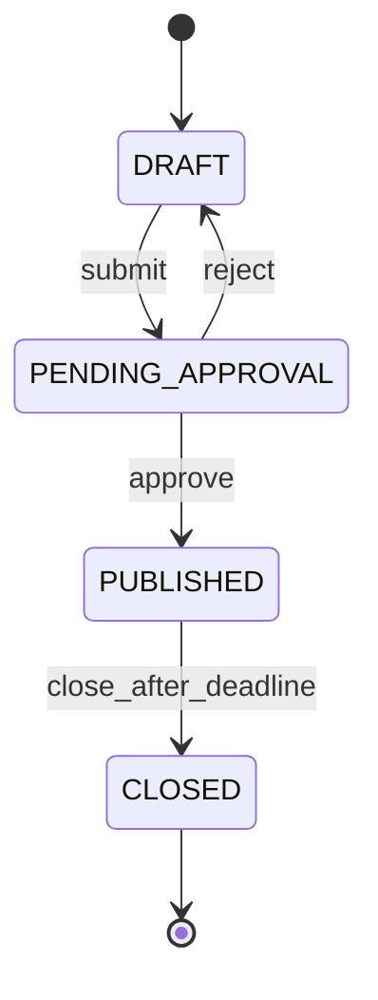
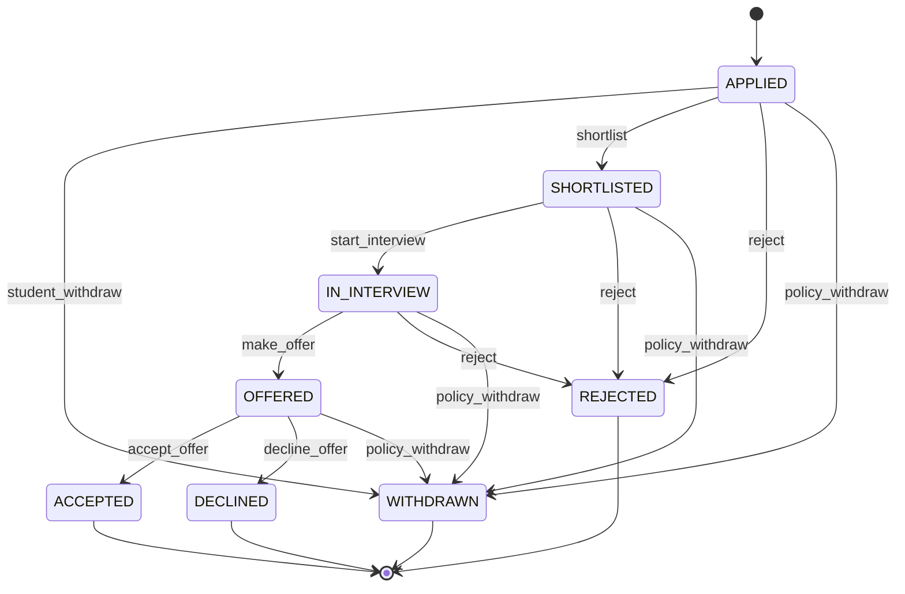

# Functional requirements

Purpose: This document defines exact CampusHire features, business rules, validation rules, and state machines.

## Functional requirement summary

| ID | Title | Priority | Roles | Linked BRs |
|---|---|---|---|---|
| FR-AUTH-01 | Student account, login, logout, and CSRF session | Must | Student | BR-01, BR-02, BR-03 |
| FR-AUTH-02 | Recruiter approval and TPO account control | Must | Recruiter, TPO, System Admin | BR-04, BR-05 |
| FR-PROFILE-01 | Student profile and TPO verification | Must | Student, TPO | BR-06, BR-07 |
| FR-PROFILE-02 | Resume upload, storage, and authorized download | Must | Student, Recruiter, TPO | BR-08, BR-09 |
| FR-POST-01 | Company profile and posting draft | Must | Recruiter | BR-10, BR-11 |
| FR-POST-02 | Posting approval and lifecycle | Must | Recruiter, TPO | BR-12, BR-13, BR-14 |
| FR-ELIG-01 | Eligibility engine with all reason codes | Must | Student | BR-15, BR-16 |
| FR-APP-01 | Apply and withdraw | Must | Student | BR-17, BR-18, BR-19 |
| FR-APP-02 | Application pipeline and timeline | Must | Recruiter, Student, TPO | BR-20, BR-21 |
| FR-REC-01 | Recruiter applicant view and filters | Must | Recruiter | BR-22, BR-09 |
| FR-JOB-01 | Job search, filters, pagination, and sorting | Must | Student | BR-23 |
| FR-TPO-01 | TPO JSON/CSV REST reports and SQL evidence | Must | TPO | BR-24, BR-25 |
| FR-API-01 | Server-side API permissions and error contracts | Must | All | BR-26 |
| FR-ADMIN-01 | Django admin master data | Must | System Admin | BR-27 |
| FR-LOCAL-01 | Reproducible local start, fixtures, and persisted stop/start | Must | All | BR-38 |
| FR-POLICY-01 | Dream-offer placement policy | Should | Student, TPO | BR-28 |
| FR-REC-02 | Bulk status updates | Should | Recruiter | BR-29 |
| FR-NOTIF-01 | Local e-mail, API notifications, and reminders | Should | All | BR-30 |
| FR-OFFER-01 | Offer acceptance deadline | Should | Student, Recruiter | BR-31 |
| FR-AUDIT-01 | Application audit log | Should | TPO | BR-32 |
| FR-REPORT-01 | Filtered applicant CSV exports | Should | Recruiter, TPO | BR-33 |
| FR-SQL-01 | Advanced SQL report consistency and query budgets | Should | TPO | BR-34 |
| FR-SCHED-01 | Interview scheduling invites | Could | Recruiter, Student | BR-35 |
| FR-RESUME-02 | Resume keyword extraction | Could | Student, Recruiter | BR-37 |

## Must functional requirements

### FR-AUTH-01: Student account, login, logout, and CSRF session

Students MUST self-register only with the college domain `sitm.example.in`. Login MUST use Django session authentication. API clients MUST retain the session/CSRF cookies and send the current CSRF token on unsafe requests. Anonymous registration and login MUST explicitly enforce CSRF. Logout MUST invalidate the server session.

Priority: Must  
Roles: Student  
Linked BR IDs: BR-01, BR-02, BR-03

Acceptance criteria:

1. Given `aarav.rao@sitm.example.in`, when Aarav registers with a valid password, then the account is created with role `STUDENT` and response status `201`.
2. Given `aarav.rao@gmail.com`, when Aarav submits registration, then the account is not created and the response is `400` with `college-email-required`.
3. Given a logged-in student with CGPA `8.20`, when the client sends `PATCH /api/me/profile/` without `X-CSRFToken`, then the API returns `403 csrf-failed` and the stored CGPA stays `8.20`.
4. Given Aarav logs out, when he requests `/api/me/applications/` using the old cookie, then the API returns `403 authentication-required` with no application data.

### FR-AUTH-02: Recruiter approval and TPO account control

Recruiters MUST register and can log in while approval is pending. Recruiter feature endpoints MUST stay blocked until TPO approval. TPO accounts MUST be created by the System Admin in Django admin. Rejected recruiters MUST see the rejection reason.

Priority: Must  
Roles: Recruiter, Placement Officer, System Admin  
Linked BR IDs: BR-04, BR-05

Acceptance criteria:

1. Given Rohan registers for Navira Systems, when he logs in before TPO approval, then login returns `200`, `role=RECRUITER`, and `approval_status=PENDING`; recruiter features return `403 recruiter-pending-approval`.
2. Given Meera approves Rohan, when Rohan requests `/api/recruiter/company/` with an authenticated session, then the API returns `200` and his company stub.
3. Given Meera rejects a recruiter with reason `Company email could not be verified`, when the recruiter logs in, then the API returns `403 recruiter-rejected` with that exact reason.

### FR-PROFILE-01: Student profile and TPO verification

Students MUST maintain personal details, academics, skills, and links. Draft profiles MAY have empty required fields. Required profile fields MUST be complete before submit, verification, and application. A TPO user MUST verify the profile before the student can apply.

Priority: Must  
Roles: Student, Placement Officer  
Linked BR IDs: BR-06, BR-07

Acceptance criteria:

1. Given Aarav has CGPA `8.20`, branch `CSE`, graduation year `2027`, and active backlogs `0`, when he saves academics, then the profile is saved.
2. Given CGPA `10.50`, when Aarav saves academics, then the database is unchanged and the response is `400` with `cgpa-out-of-range`.
3. Given Aarav lacks a 12th percentage, when he tries to apply, then eligibility includes `PROFILE_INCOMPLETE`.
4. Given Meera verifies Aarav's profile, when Aarav requests `/api/me/profile/`, then profile status is `VERIFIED`.
5. Given Aarav's verified CGPA is `8.20`, when he changes it to `9.00`, then profile status becomes `DRAFT` and a later apply request returns `403` with `profile-not-verified`.

### FR-PROFILE-02: Resume upload, storage, and authorized download

Students MUST upload only PDF resumes with a maximum size of 2 MB. The backend MUST check PDF content, not only the extension. Resume downloads MUST require authorization.

Priority: Must  
Roles: Student, Recruiter, Placement Officer  
Linked BR IDs: BR-08, BR-09

Acceptance criteria:

1. Given `aarav-resume.pdf` is 1.4 MB and starts with a valid PDF signature, when Aarav uploads it, then the system stores it under private media and marks it as current.
2. Given `notes.pdf` contains plain text and not PDF content, when Aarav uploads it, then no file is stored and the response is `400` with `resume-not-pdf`.
3. Given a 2.1 MB PDF, when Aarav uploads it, then the current resume remains unchanged and the response is `400` with `resume-too-large`.
4. Given Rohan owns posting `NAV-FT-2027`, when he downloads Aarav's resume for that posting, then the API returns the file; for another company's posting it returns `403`.

### FR-POST-01: Company profile and posting draft

A recruiter registration MUST create a company stub with `company_name`. An approved recruiter MUST complete industry, headquarters, and description before the first posting. The recruiter MUST create posting drafts with title, type, compensation, locations, eligibility rules, deadline, and selection rounds.

Priority: Must  
Roles: Recruiter  
Linked BR IDs: BR-10, BR-11

Acceptance criteria:

1. Given Rohan registers with company `Navira Systems Pvt Ltd`, when he requests the company endpoint after approval, then the API returns the linked company stub.
2. Given Rohan creates `Associate Software Engineer`, type `FULL_TIME`, CTC `8.50`, and location `Bengaluru`, then the posting is saved as `DRAFT`.
3. Given an internship posting has no stipend, when Rohan saves it, then the draft is rejected with `400` and `stipend-required`.

### FR-POST-02: Posting approval and lifecycle

A posting MUST move through `DRAFT`, `PENDING_APPROVAL`, `PUBLISHED`, and `CLOSED`. The TPO MUST approve or reject with a reason. A published posting MUST close automatically after its deadline.

Priority: Must  
Roles: Recruiter, Placement Officer  
Linked BR IDs: BR-12, BR-13, BR-14

Acceptance criteria:

1. Given a complete `DRAFT` posting, when Rohan submits it, then its state becomes `PENDING_APPROVAL`.
2. Given Meera approves a pending posting with deadline `2026-11-20T17:00:00+05:30`, when the approval succeeds, then the state becomes `PUBLISHED`.
3. Given Meera rejects a pending posting with reason `CTC value missing`, when Rohan opens it, then the state returns to `DRAFT` and the reason is visible.
4. Given current time is after `2026-11-20T17:00:00+05:30`, when the close-postings command runs, then the posting state becomes `CLOSED`.

### FR-ELIG-01: Eligibility engine with all reason codes

The system MUST evaluate every rule for a student and posting. The result MUST be `Eligible` only when no reason codes are returned. The student MUST see all reasons at once.

Priority: Must  
Roles: Student  
Linked BR IDs: BR-15, BR-16

Acceptance criteria:

1. Given Aarav has CGPA `8.20`, branch `CSE`, year `2027`, backlogs `0`, verified profile, no application, and deadline in future, when he opens a matching posting, then the result is `Eligible`.
2. Given Diya has CGPA `6.40`, branch `EEE`, and one backlog for a posting requiring CGPA `7.00`, branches `CSE, ISE`, and backlogs `0`, when she opens the posting, then she sees `CGPA_BELOW_MINIMUM`, `BRANCH_NOT_ALLOWED`, and `ACTIVE_BACKLOGS_EXCEEDED`.
3. Given Aarav already applied to `NAV-FT-2027`, when he opens the same posting, then he sees `ALREADY_APPLIED`.
4. Given a posting deadline has passed, when Aarav checks eligibility, then JSON includes `DEADLINE_PASSED`; an apply request returns `409 deadline-passed`.

### FR-APP-01: Apply and withdraw

A student MUST create at most one application per posting. A student MUST apply only when eligible and before the deadline. A student MAY withdraw only before shortlisting.

Priority: Must  
Roles: Student  
Linked BR IDs: BR-17, BR-18, BR-19

Acceptance criteria:

1. Given Aarav is eligible for `NAV-FT-2027`, when he sends POST apply with valid CSRF, then one application is created in state `APPLIED`.
2. Given Aarav has an `APPLIED` application, when he sends POST withdraw, then state becomes `WITHDRAWN`.
3. Given Aarav has a `SHORTLISTED` application, when he requests withdrawal, then state stays `SHORTLISTED` and the response is `409` with `withdrawal-not-allowed`.
4. Given Aarav already has an application for the posting, when he repeats POST apply, then no duplicate row is created and the response is `409` with `application-already-exists`.

### FR-APP-02: Application pipeline and timeline

The recruiter MUST update one application at a time through the allowed pipeline. The student MUST see a timestamped timeline. Rejection is allowed from any state before `OFFERED`.

Priority: Must  
Roles: Recruiter, Student, Placement Officer  
Linked BR IDs: BR-20, BR-21

Acceptance criteria:

1. Given Aarav is `APPLIED`, when Rohan changes him to `SHORTLISTED`, then the timeline records actor Rohan and the timestamp.
2. Given Aarav is `OFFERED`, when Rohan tries to set `REJECTED`, then the timeline is unchanged and the response is `409` with `transition-not-allowed`.
3. Given Aarav is `OFFERED`, when Aarav accepts, then state becomes `ACCEPTED`.
4. Given Aarav is `IN_INTERVIEW`, when Rohan marks rejected, then state becomes `REJECTED`.

### FR-REC-01: Recruiter applicant view and filters

Recruiters MUST view applicants only for their own postings. The list MUST filter by branch and minimum CGPA. Resume download MUST use the authorization rule.

Priority: Must  
Roles: Recruiter  
Linked BR IDs: BR-22, BR-09

Acceptance criteria:

1. Given Rohan owns `NAV-FT-2027`, when he opens applicants, then he sees only applications for Navira postings.
2. Given applicants from `CSE` and `ECE`, when Rohan filters branch `CSE`, then only `CSE` rows remain.
3. Given minimum CGPA filter `8.00`, when Rohan applies it, then applicants with CGPA `7.99` are excluded.
4. Given Rohan requests another company's applicant list, then no applicant rows are returned and the response is `403` with `posting-not-owned`.

### FR-JOB-01: Job search, filters, pagination, and sorting

Students MUST search published jobs by keyword, type, location, minimum CTC, and `eligible_only` query parameter. Results MUST be paginated. Sorting MUST support deadline and CTC.

Priority: Must  
Roles: Student  
Linked BR IDs: BR-23

Acceptance criteria:

1. Given three published jobs, when Aarav searches keyword `software`, then titles or descriptions containing `software` are returned.
2. Given page size `10`, when 23 jobs match, then page 3 contains 3 jobs.
3. Given eligible-only is true, when a job returns any eligibility reason, then it is excluded.
4. Given sort `ctc_desc`, when two jobs offer `8.50` and `6.25` LPA, then `8.50` appears first.

### FR-TPO-01: TPO JSON/CSV REST reports and SQL evidence

The TPO MUST obtain registered students, verified students, placed percentage, accepted full-time offer count, highest CTC, average CTC, median CTC, branch-wise placement, and company-wise offers through `/api/tpo/reports/summary/`, `/api/tpo/reports/branch-report/`, and `/api/tpo/reports/company-report/`. All three MUST support JSON and `?format=csv` with the exact schemas and ordering in document 08. A placed student is a distinct student with an `ACCEPTED` application for a `FULL_TIME` posting. Placed percentage is placed students divided by registered students, multiplied by 100, and rounded to 2 decimals. It is `0.00` when there are no registered students. CTC metrics use accepted full-time applications only. Median for an even count is the mean of the two middle values. The branch-wise report MUST use handwritten SQL with a dense rank by accepted offers in each branch.

Priority: Must  
Roles: Placement Officer  
Linked BR IDs: BR-24, BR-25

Acceptance criteria:

1. Given 100 registered students and 72 verified students, when Meera requests the summary as JSON and CSV, then both return those exact counts.
2. Given accepted full-time CTC values `6.00`, `8.00`, and `10.00`, when metrics calculate, then average CTC is `8.00` LPA and median CTC is `8.00` LPA.
3. Given CSE has accepted full-time offers from Navira and Prava Labs, when branch-wise report runs, then companies are dense-ranked by accepted offer count within CSE.
4. Given no accepted offers exist, when Meera requests the summary, then JSON CTC fields are `null` and CSV CTC cells are empty; zero registered students gives placed percentage `0.00`.

### FR-API-01: Server-side API permissions and error contracts

Every protected endpoint MUST enforce role and object ownership on the server. API users receive the error envelope in document 08, not redirects. The OpenAPI schema MUST describe permissions, request types, successful responses, and errors. Clients are Python tests or an API client; no custom interface is required or permitted.

Priority: Must  
Roles: All  
Linked BR IDs: BR-26

Acceptance criteria:

1. Given a student session, when Aarav requests `/api/recruiter/postings/`, then the API returns `403 role-not-allowed` without recruiter data.
2. Given no published jobs match `q=unmatched`, when Aarav searches, then the API returns `200`, `count=0`, and `results=[]`.
3. Given an expired session, when a protected endpoint is requested, then it returns `403 authentication-required` with no `Location` redirect; ownership failures keep their distinct error keys.
4. Given a generated OpenAPI schema, when request/response fixtures are compared with it, then fields, decimal strings, pagination, and documented error statuses match.

### FR-ADMIN-01: Django admin master data

The System Admin MUST use the built-in local Django admin for branches, skills, college settings, and staff accounts. Business approvals and application transitions MUST use the authorized REST services, including when an admin invokes them. No custom admin interface is built.

Priority: Must  
Roles: System Admin  
Linked BR IDs: BR-27

Acceptance criteria:

1. Given Kavya creates branch `CSE`, when a posting selects allowed branches, then `CSE` is available.
2. Given Kavya changes college e-mail domain to `sitm.example.in`, when a student registers with another domain, then registration fails.
3. Given Kavya disables skill `Blockchain`, when a student edits skills, then `Blockchain` cannot be newly selected.

### FR-LOCAL-01: Reproducible local start, fixtures, and persisted stop/start

The student MUST implement the start, stop, and explicitly confirmed reset entry points in document 06. Startup initializes PostgreSQL migrations, fictional seed data, and private resume fixtures. After initial downloads, the default local profile MUST require no internet, external API, paid account, or public hostname.

Priority: Must. Roles: All. Linked BR IDs: BR-38.

Acceptance criteria:

1. Given a clean implementation clone and cached dependencies/images, when `sh scripts/local-start.sh --profile lite` runs, then both documented health checks pass and seeded Aarav can authenticate.
2. Given the local demo clock and seed, when Aarav requests Navira eligibility without external network access, then the API returns `200`, `label=Eligible`, `reason_ids=[]`, and `messages=[]`.
3. Given Aarav creates an application and uploads the recorded PDF, when stop then start runs, then the same application ID, timeline count, and PDF SHA-256 remain.
4. Given PostgreSQL is unavailable or port `8000` is occupied, when startup is attempted, then it exits nonzero with the specific local dependency/port diagnostic and deletes no data.

## Should and Could functional requirements

| ID | Requirement | Acceptance criteria summary |
|---|---|---|
| FR-POLICY-01 | The dream-offer policy SHOULD be configurable by TPO. After one accepted full-time offer, new full-time applications are allowed only when CTC is at least 1.5 × accepted CTC. Internship offers do not block at that stage. The student can accept at most 2 full-time offers. The second accepted full-time offer withdraws all other active applications in one transaction. After the second accepted full-time offer, every new application fails with `403 policy-limit-reached`, including full-time, internship, and internship-with-PPO postings. | Block a `9.00` LPA full-time application after a `7.00` LPA accepted offer; allow `10.50` LPA; withdraw active applications after the second accepted full-time offer; block the next full-time, internship, and internship-with-PPO applications. |
| FR-REC-02 | Recruiters SHOULD update many applications from `APPLIED` to `SHORTLISTED` in one reviewed action. | Bulk change 12 selected applications; reject mixed-company selections. |
| FR-NOTIF-01 | The system SHOULD store API-readable notifications and send local e-mail through Mailpit for approval, shortlisting, offers, rejection, withdrawal, and deadline reminders. Delivery is at least once with de-duplication. | One notification with key `deadline:NAV-FT-2027:Aarav` exists after retry. |
| FR-OFFER-01 | Offers SHOULD have a 7-day acceptance deadline. Expired offers SHOULD move to `DECLINED` with reason `offer-expired`. | Offer made on 1 Nov expires after 8 Nov 00:00 IST if not accepted. |
| FR-AUDIT-01 | The system SHOULD keep an audit log for application status changes. | TPO sees actor, old state, new state, timestamp, and reason. |
| FR-REPORT-01 | Recruiter and TPO applicant endpoints SHOULD support filtered CSV exports with the same permissions as JSON lists. TPO placement report CSV is already Must under FR-TPO-01. | `branch=CSE` excludes ECE applicants; CSV omits storage keys and private resume bytes. |
| FR-SQL-01 | Reports SHOULD include SQL query-count and tie-ranking regression checks. | Summary and branch report each use at most 5 SQL queries for 5,000 applications; tied company offer counts receive the same dense rank. |
| FR-SCHED-01 | Interview scheduling MAY create `.ics` invites. | Student downloads an invite for an interview slot. |
| FR-RESUME-02 | Resume keyword extraction MAY suggest simple keywords. | Recruiter sees extracted keywords after upload. |

## Business rules

| ID | Exact rule | Exact values | Used by |
|---|---|---|---|
| BR-01 | Student e-mail MUST end with the configured college domain. | Default domain: `sitm.example.in`. | FR-AUTH-01 |
| BR-02 | Session cookies MUST protect authenticated API sessions. | `HttpOnly=true`, `Secure=true` outside local HTTP, `SameSite=Lax`, idle lifetime `8 hours`, absolute lifetime `14 days`. | FR-AUTH-01 |
| BR-03 | Unsafe API requests MUST include CSRF header. | Header `X-CSRFToken`; cookie name `csrftoken`; methods `POST`, `PUT`, `PATCH`, `DELETE`. | FR-AUTH-01 |
| BR-04 | Recruiters can log in while pending, but cannot access recruiter feature endpoints until approved. | Statuses: `PENDING`, `APPROVED`, `REJECTED`; pending feature access returns `403 recruiter-pending-approval`; rejected login returns `403 recruiter-rejected` with the TPO reason. | FR-AUTH-02 |
| BR-05 | TPO accounts are not self-service. | Created by System Admin only. | FR-AUTH-02 |
| BR-06 | Required student profile fields MUST be present before submit, verification, and applying. | Name, roll number, branch, graduation year, CGPA, active backlogs, 10th %, 12th %, skills, resume, phone. Draft profiles MAY leave them empty. | FR-PROFILE-01 |
| BR-07 | TPO verification is required before applying. | Profile states: `DRAFT`, `SUBMITTED`, `VERIFIED`, `REJECTED`. Changing any BR-06 field or current resume on a verified profile resets it to `DRAFT` and clears verifier and time. | FR-PROFILE-01 |
| BR-08 | Resume upload accepts PDF content only. | Max `2 MB`; current file starts with PDF signature; extension `.pdf`; private media storage. | FR-PROFILE-02 |
| BR-09 | Resume download requires a related application and authorized role. | Student owner, recruiter owning posting, TPO, or System Admin. | FR-PROFILE-02, FR-REC-01 |
| BR-10 | Posting type controls compensation fields. | `FULL_TIME` needs CTC LPA; `INTERNSHIP` needs stipend; `INTERNSHIP_WITH_PPO` needs stipend and optional PPO CTC. | FR-POST-01 |
| BR-11 | Selection rounds are ordered. | Minimum 1 round; names are non-empty; order starts at 1. | FR-POST-01 |
| BR-12 | Posting states are controlled. | `DRAFT`, `PENDING_APPROVAL`, `PUBLISHED`, `CLOSED`. | FR-POST-02 |
| BR-13 | Rejection requires a TPO reason. | Reason length 10 to 500 characters. | FR-POST-02 |
| BR-14 | A published posting closes after deadline. | Close command or request-time guard sets `CLOSED` when `now >= deadline_at`. | FR-POST-02 |
| BR-15 | Eligibility returns all failing reason codes. | Codes listed in the eligibility table below. | FR-ELIG-01 |
| BR-16 | Eligible means zero failing rules. | Result label is `Eligible` or `Not eligible`. | FR-ELIG-01 |
| BR-17 | One student has one application per posting. | Unique pair: student profile and posting. | FR-APP-01 |
| BR-18 | Apply is allowed only before deadline on published postings. | `posting.state=PUBLISHED` and `now < deadline_at`. | FR-APP-01 |
| BR-19 | Withdrawal is allowed only before shortlisting. | Current state must be `APPLIED`. | FR-APP-01 |
| BR-20 | Application states are controlled. | `APPLIED`, `SHORTLISTED`, `IN_INTERVIEW`, `OFFERED`, `ACCEPTED`, `DECLINED`, `REJECTED`, `WITHDRAWN`. | FR-APP-02 |
| BR-21 | Recruiter updates one application per request in MUST scope. | Bulk update is Should only. | FR-APP-02 |
| BR-22 | Recruiters see only their own postings. | Company ownership is checked on every applicant query. | FR-REC-01 |
| BR-23 | Job list pagination has bounded page size. | Default `10`, maximum `50`; sort values `deadline_asc`, `deadline_desc`, `ctc_asc`, `ctc_desc`. | FR-JOB-01 |
| BR-24 | Placement and CTC reports use accepted full-time offers only. | Placed student is a distinct student with an accepted full-time application. Accepted offer count counts accepted full-time applications. CTC uses `Application.offer_ctc_lpa`, not advertised posting CTC. Placed percentage is placed students ÷ registered students × 100, rounded to 2 decimals; zero denominator gives `0.00`. Internship stipend and PPO offers are excluded. | FR-TPO-01 |
| BR-25 | SQL report requires query-plan evidence. | Save `EXPLAIN ANALYZE` notes for branch-wise and job-search queries. | FR-TPO-01 |
| BR-26 | API roles and object ownership are checked server-side. | Student owns profile/application; recruiter owns company/posting; TPO and ADMIN may use TPO endpoints. Wrong role returns `403 role-not-allowed`; missing session returns `403 authentication-required`; no redirects. | FR-API-01 |
| BR-27 | Admin master data controls branch and skill choices. | Branch codes: `CSE`, `ISE`, `ECE`, `EEE`, `ME`, `CV`. | FR-ADMIN-01 |
| BR-28 | Dream-offer policy uses accepted full-time offers only. | Threshold `1.5 × highest accepted full-time CTC`; max accepted full-time offers `2`; active states are `APPLIED`, `SHORTLISTED`, `IN_INTERVIEW`, and `OFFERED`; second acceptance uses `policy_withdraw` for other active applications. | FR-POLICY-01 |
| BR-29 | Bulk status update cannot cross company ownership. | All selected applications must belong to recruiter's company. | FR-REC-02 |
| BR-30 | Notification delivery is at least once. | De-dup key per event and recipient. | FR-NOTIF-01 |
| BR-31 | Offer acceptance expires after 7 calendar days. | Expiry at `offer_made_at + 7 days`. | FR-OFFER-01 |
| BR-32 | Audit log is append-only for status changes. | Actor, action, old state, new state, reason, timestamp. | FR-AUDIT-01 |
| BR-33 | CSV exports include active filters and enforce authorization. | UTF-8 CSV with header row; no resume bytes, storage keys, or session tokens. | FR-REPORT-01 |
| BR-34 | Advanced SQL checks preserve report semantics as data grows. | Maximum 5 queries per summary/branch request; dense rank ties are consecutive without gaps. | FR-SQL-01 |
| BR-35 | Interview invite times use Asia/Kolkata. | `.ics` times include timezone or UTC conversion. | FR-SCHED-01 |
| BR-37 | Resume keywords are suggestions, not eligibility criteria. | Max 20 keywords per resume. | FR-RESUME-02 |
| BR-38 | Local lifecycle commands MUST preserve data and use loopback bindings. | Fixed ports and named volumes in document 06; stop never deletes volumes; reset requires `--confirm-delete-local-data`; cached local runtime needs no external network. | FR-LOCAL-01 |

## Eligibility engine

The engine MUST evaluate these rules in every check. It MUST return reason codes in the order shown.

| Rule | Reason code | Student-visible message |
|---|---|---|
| Student profile required fields are missing. | `PROFILE_INCOMPLETE` | Complete your profile before applying. |
| TPO has not verified the student profile. | `PROFILE_NOT_VERIFIED` | The TPO must verify your profile before you apply. |
| Posting is not `PUBLISHED`. | `POSTING_NOT_OPEN` | This posting is not open for applications. |
| Current time is on or after deadline. | `DEADLINE_PASSED` | The application deadline has passed. |
| Student already has an application for the posting. | `ALREADY_APPLIED` | You have already applied to this posting. |
| Student CGPA is below posting minimum. | `CGPA_BELOW_MINIMUM` | Your CGPA is below the minimum required for this posting. |
| Student branch is not in allowed branches. | `BRANCH_NOT_ALLOWED` | Your branch is not eligible for this posting. |
| Student graduation year is not allowed. | `GRAD_YEAR_NOT_ALLOWED` | Your graduation year is not eligible for this posting. |
| Student active backlogs exceed maximum. | `ACTIVE_BACKLOGS_EXCEEDED` | Your active backlogs exceed the allowed limit. |
| Dream-offer policy blocks the application. | `DREAM_POLICY_BLOCKED` | Your accepted offer allows only higher full-time postings under the dream-offer policy. |

## Posting lifecycle state machine

| From | Event | Guard | To | Actor |
|---|---|---|---|---|
| `DRAFT` | `submit` | Required posting fields complete | `PENDING_APPROVAL` | Recruiter |
| `PENDING_APPROVAL` | `approve` | TPO approval and deadline in future | `PUBLISHED` | Placement Officer |
| `PENDING_APPROVAL` | `reject` | Rejection reason length 10 to 500 chars | `DRAFT` | Placement Officer |
| `PUBLISHED` | `close_after_deadline` | `now >= deadline_at` | `CLOSED` | System command or request guard |

## Application state machine

| From | Event | Guard | To | Actor |
|---|---|---|---|---|
| None | `apply` | Eligible and no existing application | `APPLIED` | Student |
| `APPLIED` | `student_withdraw` | Before shortlisting | `WITHDRAWN` | Student |
| `APPLIED` | `shortlist` | Recruiter owns posting | `SHORTLISTED` | Recruiter |
| `APPLIED` | `reject` | Recruiter owns posting | `REJECTED` | Recruiter |
| `SHORTLISTED` | `start_interview` | Recruiter owns posting | `IN_INTERVIEW` | Recruiter |
| `SHORTLISTED` | `reject` | Recruiter owns posting | `REJECTED` | Recruiter |
| `IN_INTERVIEW` | `make_offer` | Recruiter owns posting. Full-time offers require `offer_ctc_lpa` from `0.50` to `100.00`. Internship offers require `offer_stipend_monthly` from `0` to `300000`. PPO CTC is optional for `INTERNSHIP_WITH_PPO`. | `OFFERED` | Recruiter |
| `IN_INTERVIEW` | `reject` | Recruiter owns posting | `REJECTED` | Recruiter |
| `OFFERED` | `accept_offer` | Student owns application | `ACCEPTED` | Student |
| `OFFERED` | `decline_offer` | Student owns application | `DECLINED` | Student |
| Active states | `policy_withdraw` | Student accepted the second full-time offer; states are `APPLIED`, `SHORTLISTED`, `IN_INTERVIEW`, and `OFFERED` | `WITHDRAWN` | System |

## Validation rules

| Field | Rule | Error message or code |
|---|---|---|
| student email | Must end with `@sitm.example.in` by default | `college-email-required` |
| password | Minimum 12 characters | `password-too-short` |
| roll number | Required, unique, format `SITM-YYYY-NNNN` | `roll-number-invalid` |
| branch | One of active branch codes | `branch-invalid` |
| graduation year | Integer between 2026 and 2030 | `graduation-year-invalid` |
| CGPA | Decimal from `0.00` to `10.00` | `cgpa-out-of-range` |
| active backlogs | Integer from 0 to 20 | `backlogs-out-of-range` |
| 10th and 12th percentage | Decimal from `0.00` to `100.00` | `percentage-out-of-range` |
| resume | PDF content, `.pdf`, max 2 MB | `resume-not-pdf`, `resume-too-large` |
| CTC LPA | Decimal from `0.50` to `100.00` | `ctc-out-of-range` |
| stipend monthly | Integer from 0 to 300000 | `stipend-out-of-range` |
| deadline | Future timestamp in Asia/Kolkata display | `deadline-must-be-future` |
| rejection reason | 10 to 500 characters | `reason-required` |
| page size | 1 to 50 | `page-size-out-of-range` |

## Error scenarios

| Condition | System response | User-visible message or status |
|---|---|---|
| Missing CSRF header on unsafe request | Return `403`; do not change data | Your session security token is missing. Refresh and try again. |
| Expired or missing session on protected API | Return `403` with `authentication-required`; no redirect | Your session expired. Please log in again. |
| Recruiter pending approval | Return `403` | Your recruiter account is waiting for TPO approval. |
| Posting deadline passed during apply | Set posting `CLOSED` if needed; return `409` | The application deadline has passed. |
| Duplicate application | Return `409`; keep existing row | You have already applied to this posting. |
| Unauthorized resume download | Return `403`; do not reveal file path | You are not allowed to download this resume. |
| Invalid pipeline transition | Return `409`; record no timeline event | This status change is not allowed. |
| Report query timeout | Return `503 report-timeout` for that report endpoint | This report is taking too long. Try again later. |
| File storage unavailable | Return `503`; keep old resume | Resume upload is temporarily unavailable. |
| PostgreSQL unavailable | Return `503 database-unavailable`; no partial state or timeline write | The local PostgreSQL service is unavailable. |

[Back to README](../README.md)
