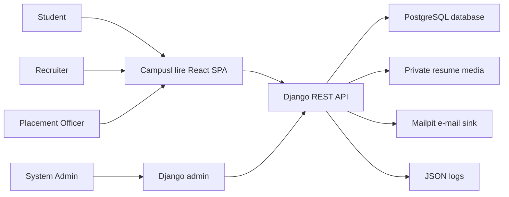
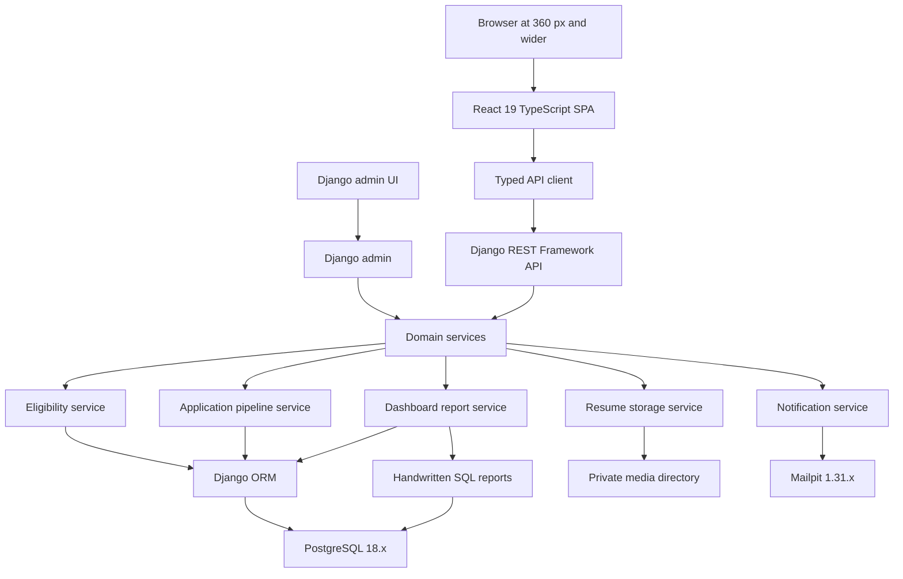
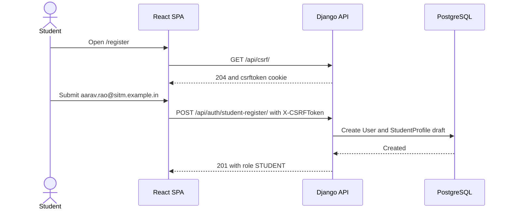
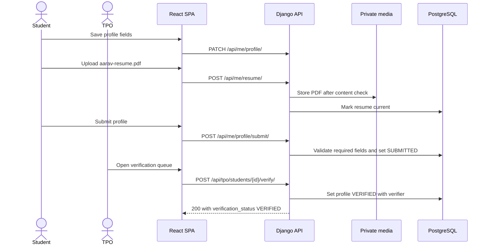
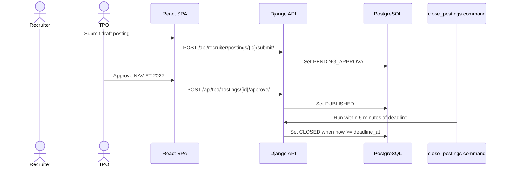
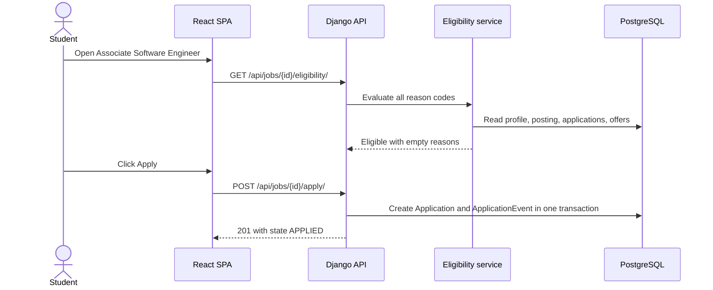
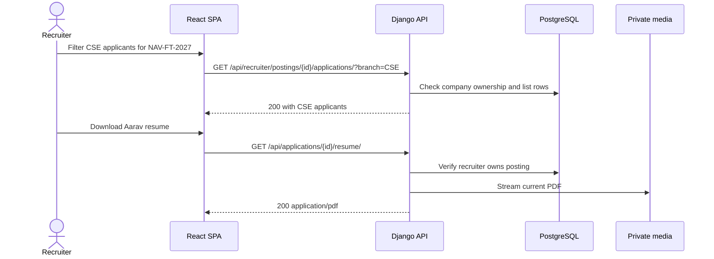

# System architecture

Purpose: This document describes the CampusHire architecture, key flows, data movement, local deployment, repository structure, design principles, and required ADRs.

## Architecture goals

CampusHire MUST give each role a safe, clear placement workflow. The backend MUST enforce every business rule. The React SPA MAY hide unavailable actions, but it MUST NOT be the only control.

## Context diagram



## Container diagram



## Key sequence diagrams

### Student registration and CSRF session



### Profile completion, resume upload, and verification



### Posting approval and deadline closure



### Eligibility check and application



### Recruiter status update and authorized resume download



## Data-flow description

| Flow | Data items | Stores touched | Controls |
|---|---|---|---|
| Account and session | E-mail, password hash, role, session ID, CSRF token | User, session table | College domain, secure cookies, CSRF header |
| Student profile | Roll number, branch, year, CGPA, backlogs, percentages, skills, links | StudentProfile, StudentSkill | Field validation and TPO verification |
| Resume upload | File name, size, PDF signature, hash, private key | ResumeDocument, private media | Check the file starts with `%PDF-`, enforce 2,097,152 byte limit, avoid native `libmagic` |
| Posting lifecycle | Company, compensation, eligibility, rounds, deadline, state | Company, Posting, PostingBranch, SelectionRound | Ownership, TPO approval, deadline closure |
| Eligibility | Profile, posting rules, existing application, accepted offers | StudentProfile, Posting, Application | All reason codes returned in fixed order |
| Application pipeline | Current state, actor, reason, timestamp | Application, ApplicationEvent | Transactional state and timeline update |
| Dashboard reports | Student counts, offers, CTC metrics, branch ranks | StudentProfile, Application, Posting, Company | Accepted full-time offers only; query plan evidence |

Private resume bytes MUST NOT appear in logs, list responses, or CSV exports.

## Local deployment view

| Profile | Host resources | Running services | Notes |
|---|---|---|---|
| Standard | 16 GB RAM, Docker memory 8 GB, swap 4 GB | Django, React dev server, PostgreSQL, Mailpit, Playwright browser | Use for full local E2E and dashboard performance runs. |
| Lite | 8 GB RAM, Docker memory 4 GB, swap 4 GB | PostgreSQL 768 MB, Django 768 MB, React on host or 512 MB container | Turn off production-like Nginx/Gunicorn and optional task queue. |

Windows students MUST use WSL2 Ubuntu. The 8 GB `.wslconfig` values are `memory=4GB` and `swap=4GB`. The 16 GB values are `memory=8GB` and `swap=4GB`. The trainer MUST pre-check the lite profile before week 1.

## Expected student repository folder tree

```text
campushire/
├── backend/
│   ├── campus_hire/
│   ├── accounts/
│   ├── profiles/
│   ├── companies/
│   ├── postings/
│   ├── applications/
│   ├── reports/
│   ├── notifications/
│   └── tests/
├── frontend/
│   ├── src/
│   │   ├── api/
│   │   ├── components/
│   │   ├── features/
│   │   ├── routes/
│   │   └── test/
│   └── e2e/
├── docs/
│   ├── adr/
│   ├── query-plans/
│   └── test-reports/
├── scripts/
└── README.md
```

The folder names are guidance for the implementation repository. The specification repository MUST contain Markdown documents only.

## Design principles

| Principle | CampusHire use |
|---|---|
| Server-side authorization | Every API checks role and ownership before it reads or writes data. |
| Layered backend | Views validate HTTP data. Services enforce placement rules. Models persist data. |
| One transaction for state changes | Application state and timeline event change together. |
| Private-by-default files | Resumes are streamed after authorization. Direct public media URLs are not used. |
| Progressive frontend | Route guards and disabled buttons improve UX. Backend rules remain authoritative. |
| 12-factor configuration | Domain, cookie settings, database URL, media path, and mail settings come from environment variables. |
| Local-first development | All Must features run on a laptop without paid cloud services. |
| Measured performance | Dashboard and job search require seed data and saved query-plan evidence. |

## ADRs the student MUST write

| ADR ID | Topic | Exact question to answer |
|---|---|---|
| ADR-001 | Session authentication and CSRF | Why does CampusHire use Django session authentication with CSRF instead of JWT for the same-site React SPA? |
| ADR-002 | Resume storage | How are PDF resumes stored privately, scanned by content type, and served only after authorization? |
| ADR-003 | Eligibility service boundary | Which module owns eligibility reason-code evaluation, and how does it stay fully branch-tested? |
| ADR-004 | Posting deadline closure | How does the system combine request-time checks with a scheduled command to close postings within 5 minutes? |
| ADR-005 | Dashboard SQL reports | Which dashboard queries use handwritten SQL and window functions, and how are indexes justified by `EXPLAIN ANALYZE`? |
| ADR-006 | Frontend state management | Does the project use fetch or Axios, and does it add TanStack Query for server state? |
| ADR-007 | Notification delivery | If notifications are built, how does at-least-once delivery use de-duplication keys? |
| ADR-008 | Production-like profile | If the Should Compose profile is built, why are Gunicorn and Nginx introduced only outside the lite profile? |

[Back to README](../README.md)
