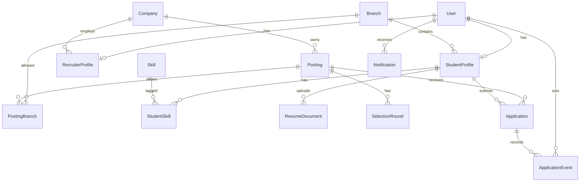

# Data model

Purpose: This document defines the required CampusHire data entities, relationships, constraints, indexes, sample data, retention, and migration policy.

## Entity overview

| Entity | Purpose |
|---|---|
| User | Authentication identity for all roles. |
| StudentProfile | Student personal and academic placement profile. |
| RecruiterProfile | Recruiter approval and company link. |
| Company | Recruiter company details. |
| Branch | College branch master data. |
| Skill | Skill tag master data. |
| StudentSkill | Student-to-skill relationship. |
| CollegeSetting | Configurable college settings. |
| ResumeDocument | Private resume metadata and storage pointer. |
| Posting | Campus job or internship posting. |
| PostingBranch | Allowed branch relationship for a posting. |
| SelectionRound | Ordered selection process for a posting. |
| Application | Student application and current state. |
| ApplicationEvent | Timeline and audit entry for an application. |
| Notification | Optional in-app notification. |

## Tables and columns

### User

| Column | Logical type | Constraints | Description |
|---|---|---|---|
| id | uuid | Primary identifier | Internal user ID. |
| email | string | Unique, required, lowercase | Login e-mail. |
| role | enum | Required | `STUDENT`, `RECRUITER`, `TPO`, or `ADMIN`. |
| is_active | boolean | Required | Blocks login when false. |
| date_joined | timestamp | Required | Account creation time. |
| last_login | timestamp | Nullable | Last successful login. |

### StudentProfile

| Column | Logical type | Constraints | Description |
|---|---|---|---|
| id | uuid | Primary identifier | Student profile ID. |
| user_id | uuid | Unique, required | Linked student user. |
| full_name | string | Required | Student name. |
| roll_number | string | Unique, format `SITM-YYYY-NNNN` | College roll number. |
| phone | string | Required | Contact number. |
| branch_id | uuid | Required | Current branch. |
| graduation_year | int | 2026 to 2030 | Passing year. |
| cgpa | decimal | 0.00 to 10.00 | Current CGPA. |
| active_backlogs | int | 0 to 20 | Active backlog count. |
| tenth_percentage | decimal | 0.00 to 100.00 | 10th percentage. |
| twelfth_percentage | decimal | 0.00 to 100.00 | 12th percentage. |
| links | json | Optional | LinkedIn, GitHub, portfolio links. |
| verification_status | enum | Required | `DRAFT`, `SUBMITTED`, `VERIFIED`, `REJECTED`. |
| verification_reason | string | Nullable | TPO rejection or correction reason. |
| verified_by_id | uuid | Nullable | TPO user who verified. |
| verified_at | timestamp | Nullable | Verification time. |
| created_at | timestamp | Required | Profile creation time. |
| updated_at | timestamp | Required | Last profile update time. |

### RecruiterProfile

| Column | Logical type | Constraints | Description |
|---|---|---|---|
| id | uuid | Primary identifier | Recruiter profile ID. |
| user_id | uuid | Unique, required | Linked recruiter user. |
| full_name | string | Required | Recruiter name. |
| designation | string | Required | HR title. |
| company_id | uuid | Required after registration | Linked company stub or completed company. |
| approval_status | enum | Required | `PENDING`, `APPROVED`, `REJECTED`. |
| approval_reason | string | Nullable | TPO decision reason. |
| approved_by_id | uuid | Nullable | TPO approver. |
| approved_at | timestamp | Nullable | Approval time. |

### Company

| Column | Logical type | Constraints | Description |
|---|---|---|---|
| id | uuid | Primary identifier | Company ID. |
| name | string | Unique, required | Fictional company name. |
| website | string | Optional URL | Company website. |
| industry | string | Required before first posting | Industry label. |
| headquarters | string | Required before first posting | City and state. |
| description | text | Required before first posting | Recruiter-managed description. |
| created_at | timestamp | Required | Creation time. |

### Branch

| Column | Logical type | Constraints | Description |
|---|---|---|---|
| id | uuid | Primary identifier | Branch ID. |
| code | string | Unique, required | `CSE`, `ISE`, `ECE`, `EEE`, `ME`, or `CV`. |
| name | string | Unique, required | Full branch name. |
| is_active | boolean | Required | Controls selection lists. |

### Skill and StudentSkill

| Column | Logical type | Constraints | Description |
|---|---|---|---|
| Skill.id | uuid | Primary identifier | Skill ID. |
| Skill.name | string | Unique, required | Skill tag name. |
| Skill.is_active | boolean | Required | Controls new selections. |
| StudentSkill.student_id | uuid | Required | Student profile. |
| StudentSkill.skill_id | uuid | Required | Skill tag. |
| StudentSkill.created_at | timestamp | Required | Add time. |

StudentSkill MUST have a unique pair of `student_id` and `skill_id`.

### CollegeSetting

| Column | Logical type | Constraints | Description |
|---|---|---|---|
| id | uuid | Primary identifier | Settings row ID. |
| college_name | string | Required | `Sahyadri Institute of Technology and Management`. |
| email_domain | string | Required | Default `sitm.example.in`. |
| dream_policy_enabled | boolean | Required | Controls Should policy. |
| dream_multiplier | decimal | Default 1.50 | Minimum CTC multiplier. |
| max_full_time_acceptances | int | Default 2 | Dream-policy acceptance cap. |
| updated_at | timestamp | Required | Last settings change. |

### ResumeDocument

| Column | Logical type | Constraints | Description |
|---|---|---|---|
| id | uuid | Primary identifier | Resume document ID. |
| student_id | uuid | Required | Owner profile. |
| original_filename | string | Required | Uploaded file name. |
| storage_key | string | Unique, required | Private media pointer. |
| content_type | string | Required | Must be `application/pdf` after content check. |
| size_bytes | int | 1 to 2,097,152 | File size. |
| sha256 | string | Required | Content hash. |
| is_current | boolean | Required | Current resume flag. |
| uploaded_at | timestamp | Required | Upload time. |

### Posting

| Column | Logical type | Constraints | Description |
|---|---|---|---|
| id | uuid | Primary identifier | Posting ID. |
| company_id | uuid | Required | Owning company. |
| created_by_id | uuid | Required | Recruiter user. |
| title | string | Required | Posting title. |
| posting_type | enum | Required | `FULL_TIME`, `INTERNSHIP`, or `INTERNSHIP_WITH_PPO`. |
| description | text | Required | Role description. |
| locations | json | Required non-empty list | City list. |
| ctc_lpa | decimal | Required for full-time | Annual CTC in LPA. |
| stipend_monthly | int | Required for internships | INR per month. |
| min_cgpa | decimal | 0.00 to 10.00 | Eligibility minimum. |
| graduation_years | json | Required list | Allowed graduation years. |
| max_active_backlogs | int | 0 to 20 | Eligibility maximum. |
| deadline_at | timestamp | Future for approval | Application deadline. |
| state | enum | Required | Posting lifecycle state. |
| rejection_reason | string | Nullable | TPO rejection reason. |
| approved_by_id | uuid | Nullable | TPO approver. |
| approved_at | timestamp | Nullable | Approval timestamp. |
| closed_at | timestamp | Nullable | Closure timestamp. |
| created_at | timestamp | Required | Creation timestamp. |
| updated_at | timestamp | Required | Update timestamp. |

### PostingBranch and SelectionRound

| Column | Logical type | Constraints | Description |
|---|---|---|---|
| PostingBranch.posting_id | uuid | Required | Posting ID. |
| PostingBranch.branch_id | uuid | Required | Allowed branch ID. |
| SelectionRound.id | uuid | Primary identifier | Selection round ID. |
| SelectionRound.posting_id | uuid | Required | Posting ID. |
| SelectionRound.round_order | int | Starts at 1 | Round order. |
| SelectionRound.name | string | Required | Example: `Technical Interview`. |
| SelectionRound.description | text | Optional | Round details. |

PostingBranch MUST have a unique pair of `posting_id` and `branch_id`. SelectionRound MUST have unique `posting_id` and `round_order`.

### Application

| Column | Logical type | Constraints | Description |
|---|---|---|---|
| id | uuid | Primary identifier | Application ID. |
| student_id | uuid | Required | Student profile. |
| posting_id | uuid | Required | Posting. |
| current_state | enum | Required | Application pipeline state. |
| offer_ctc_lpa | decimal | Nullable | Offered CTC for full-time or PPO. |
| offer_stipend_monthly | int | Nullable | Offered internship stipend. |
| offer_made_at | timestamp | Nullable | Offer timestamp. |
| offer_expires_at | timestamp | Nullable | Should item expiry. |
| applied_at | timestamp | Required | Application creation time. |
| updated_at | timestamp | Required | Last state change time. |

Application MUST have a unique pair of `student_id` and `posting_id`.

Profile completion fields MAY be empty while the profile is `DRAFT`. The BR-06 required-field rule is enforced when the student submits the profile, when the TPO verifies it, and when the student applies. Recruiter registration creates a linked company stub with `name`. The recruiter completes `industry`, `headquarters`, and `description` before creating the first posting.

### ApplicationEvent

| Column | Logical type | Constraints | Description |
|---|---|---|---|
| id | uuid | Primary identifier | Event ID. |
| application_id | uuid | Required | Application. |
| actor_user_id | uuid | Required | User who caused the event. |
| event_type | string | Required | `apply`, `shortlist`, `reject`, and similar values. |
| from_state | enum | Nullable | Previous state. |
| to_state | enum | Required | New state. |
| reason | string | Optional | Human reason. |
| created_at | timestamp | Required | Event time. |

### Notification

| Column | Logical type | Constraints | Description |
|---|---|---|---|
| id | uuid | Primary identifier | Notification ID. |
| recipient_user_id | uuid | Required | Recipient user. |
| dedup_key | string | Unique, required | At-least-once de-duplication key. |
| title | string | Required | Short text. |
| body | text | Required | Message body. |
| read_at | timestamp | Nullable | Read timestamp. |
| created_at | timestamp | Required | Creation timestamp. |

## Relationships

## Required indexes and constraints

| Requirement | Reason |
|---|---|
| Unique lowercase user e-mail. | Prevent duplicate login identities. |
| Unique student roll number. | TPO verification depends on a single college identity. |
| Unique student and posting in Application. | Enforces one application for each posting. |
| Index Posting by `state`, `deadline_at`, and `posting_type`. | Supports job search and deadline closure. |
| Index Posting `ctc_lpa` for CTC sorting. | Supports job search sort by CTC. |
| Index Application by `posting_id` and `current_state`. | Supports recruiter applicant views. |
| Index StudentProfile by `branch_id`, `cgpa`, and `graduation_year`. | Supports eligibility and recruiter filters. |
| Index ApplicationEvent by `application_id` and `created_at`. | Supports student timeline. |
| Unique Notification `dedup_key`. | Supports at-least-once notification delivery. |
| Private resume storage keys are never exposed in list responses. | Prevents direct file discovery. |

## Enumerations

| Enum | Values |
|---|---|
| UserRole | `STUDENT`, `RECRUITER`, `TPO`, `ADMIN` |
| RecruiterApprovalStatus | `PENDING`, `APPROVED`, `REJECTED` |
| ProfileVerificationStatus | `DRAFT`, `SUBMITTED`, `VERIFIED`, `REJECTED` |
| BranchCode | `CSE`, `ISE`, `ECE`, `EEE`, `ME`, `CV` |
| PostingType | `FULL_TIME`, `INTERNSHIP`, `INTERNSHIP_WITH_PPO` |
| PostingState | `DRAFT`, `PENDING_APPROVAL`, `PUBLISHED`, `CLOSED` |
| ApplicationState | `APPLIED`, `SHORTLISTED`, `IN_INTERVIEW`, `OFFERED`, `ACCEPTED`, `DECLINED`, `REJECTED`, `WITHDRAWN` |
| EligibilityReasonCode | `PROFILE_INCOMPLETE`, `PROFILE_NOT_VERIFIED`, `POSTING_NOT_OPEN`, `DEADLINE_PASSED`, `ALREADY_APPLIED`, `CGPA_BELOW_MINIMUM`, `BRANCH_NOT_ALLOWED`, `GRAD_YEAR_NOT_ALLOWED`, `ACTIVE_BACKLOGS_EXCEEDED`, `DREAM_POLICY_BLOCKED` |

## Sample data

### Branches

| Code | Name |
|---|---|
| CSE | Computer Science and Engineering |
| ISE | Information Science and Engineering |
| ECE | Electronics and Communication Engineering |
| EEE | Electrical and Electronics Engineering |
| ME | Mechanical Engineering |
| CV | Civil Engineering |

### Students

| Name | E-mail | Roll number | Branch | Year | CGPA | Backlogs |
|---|---|---|---|---|---|---|
| Aarav Rao | aarav.rao@sitm.example.in | SITM-2027-0142 | CSE | 2027 | 8.20 | 0 |
| Diya Kulkarni | diya.kulkarni@sitm.example.in | SITM-2027-0211 | EEE | 2027 | 6.40 | 1 |
| Farhan Ali | farhan.ali@sitm.example.in | SITM-2026-0088 | ISE | 2026 | 7.85 | 0 |

### Companies and postings

| Company | Posting | Type | CTC or stipend | Allowed branches | Min CGPA | Deadline |
|---|---|---|---|---|---|---|
| Navira Systems Pvt Ltd | Associate Software Engineer | FULL_TIME | 8.50 LPA | CSE, ISE, ECE | 7.00 | 2026-11-20 17:00 IST |
| Prava Labs India | Data Operations Intern | INTERNSHIP | INR 25000 per month | CSE, ISE | 6.50 | 2026-11-12 18:00 IST |
| Teralite Motors | Graduate Engineer Trainee | FULL_TIME | 6.25 LPA | ME, EEE | 6.75 | 2026-11-25 17:00 IST |

## Retention policy

| Data | Retention |
|---|---|
| User accounts and profiles | Keep for the training project lifetime. |
| Resume files | Keep only the current resume and the last two older uploads per student. |
| Applications and timeline events | Keep for the full training project. |
| Notifications | Keep unread notifications and read notifications for 90 days. |
| Logs | Keep local development logs for 14 days. |
| Query-plan evidence | Keep in student documentation until final evaluation. |

Students MUST provide a manual deletion path for demo data in local development. Production-like deletion policies are not required for the MVP.

## Migration policy

1. Every data model change MUST have a Django migration.
2. Migrations MUST be reviewed before merging.
3. Migrations MUST not delete columns with placement data unless a backup or export exists.
4. Data migrations MUST be reversible when practical.
5. Seed data for fictional branches, skills, and sample companies MAY be loaded through a documented management command.
6. Students MUST not use real student or company personal data in seed files.

[Back to README](../README.md)
