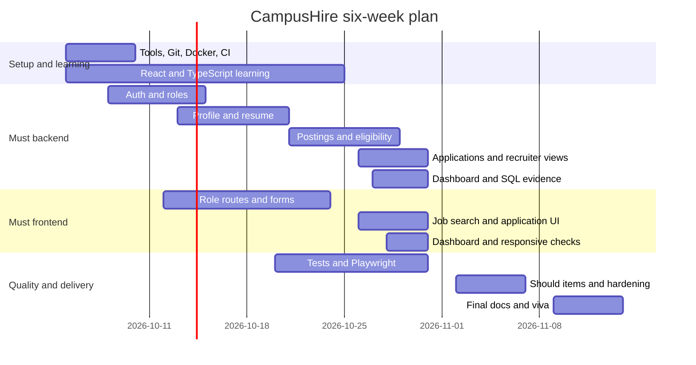

# Milestones and deliverables

Purpose: This document gives the CampusHire effort budget, six-week plan, Gantt chart, final checklist, submission steps, and demo script.

## Effort budget by feature area

The total project budget is about 180 hours. Must scope is about 120 hours. It includes 30 hours of compulsory learning: 18 hours frontend learning and 12 hours other setup, backend, SQL, testing, and CI learning.

| Feature area | Priority | Hours | Notes |
|---|---|---:|---|
| Setup, Git, CI skeleton, Docker, and other compulsory learning | Must | 12 | Includes first clean clone run and 12 hours of setup, backend, SQL, testing, and CI learning. |
| Django accounts, sessions, CSRF, and roles | Must | 12 | Covers FR-AUTH-01 and FR-AUTH-02. |
| Student profile, academics, skills, verification, and resume upload | Must | 14 | Covers FR-PROFILE-01 and FR-PROFILE-02. |
| Company, posting draft, approval, and deadline closure | Must | 13 | Covers FR-POST-01 and FR-POST-02. |
| Eligibility engine, apply, withdraw, and application pipeline | Must | 16 | Covers FR-ELIG-01, FR-APP-01, and FR-APP-02. |
| Recruiter applicants, job search, dashboard, and SQL evidence | Must | 15 | Covers FR-REC-01, FR-JOB-01, and FR-TPO-01. |
| React and TypeScript learning | Must | 18 | Frontend learning for components, props, state, hooks, effects, and typed API responses. |
| React SPA implementation and route guards | Must | 10 | Covers FR-UI-01. |
| Django admin, backend tests, frontend tests, local Playwright, and Must documentation | Must | 8 | Covers FR-ADMIN-01, test gates, ADRs, README setup, and required evidence. |
| Should features and hardening | Should | 40 | Policy, notifications, audit, charts, exports, accessibility automation, and extra quality work. |
| Final documentation, interview prep, demo video, and contingency | Should | 22 | Final polishing, viva practice, demo video, and buffer after Must scope. |
| **Total** |  | **180** |  |

## Week-by-week plan

| Week | Goals | Tasks naming FR IDs | Deliverables | Friday demo checkpoint |
|---|---|---|---|---|
| 1: 5-9 Oct | Set up tools and create the first vertical slice. | Read all docs; create `campushire`; configure Django, React, PostgreSQL, CI; record ADR for sessions and CSRF; start FR-AUTH-01 and FR-UI-01. | Green skeleton checks that exist at that time, running login page, first PR, Projects board. | Show app starts locally and CI runs on a PR. |
| 2: 12-16 Oct | Build accounts, profile, and resume foundations. | Finish FR-AUTH-01 and FR-AUTH-02; implement FR-PROFILE-01; begin FR-PROFILE-02; learn React forms and TypeScript props. | Registration, login, recruiter approval, profile form, backend tests. | Show student registration with `sitm.example.in` and profile save. |
| 3: 19-23 Oct | Build postings and eligibility. | Finish FR-PROFILE-02; implement FR-POST-01, FR-POST-02, and FR-ELIG-01; learn hooks, effects, and typed API client. | Company profile, posting approval, deadline guard, eligibility reason display. | Show Diya blocked by multiple eligibility reason codes. |
| 4: 26-30 Oct | Complete all Must workflows. | Implement FR-APP-01, FR-APP-02, FR-REC-01, FR-JOB-01, FR-TPO-01, FR-ADMIN-01; record `EXPLAIN ANALYZE` evidence. | Student apply and withdraw, recruiter pipeline, job search, dashboard, admin data. | Show the full Aarav to Navira application journey. |
| 5: 2-6 Nov | Add Should items and harden quality. | Attempt FR-POLICY-01, FR-AUDIT-01, FR-REPORT-01, FR-FEQ-01, and selected FR-NOTIF-01; close test gaps. | Dream policy if selected, audit view, charts or CSV, stricter frontend checks. | Show one Should item and updated coverage report. |
| 6: 9-13 Nov | Prepare final submission and viva. | Finish documentation, ADRs, local Playwright report, demo video, README setup, and mock interview. | Final tag `v1.0.0`, green `main`, demo video under 5 minutes, submission issue. | Run the 10-minute final demo script. |

## Gantt chart

## Final deliverables checklist

- Public GitHub repository named `campushire`.
- Trainer `@sukurcf` added as collaborator.
- README setup steps from a clean clone in 10 steps or fewer.
- Architecture diagram and at least 5 ADRs.
- Green CI on `main`.
- Backend coverage report with required gates.
- Frontend coverage report with 60% line coverage.
- Local Playwright HTML report for at least 4 journeys.
- Evidence for branch-wise and job-search `EXPLAIN ANALYZE`.
- `.env.example` without secrets.
- CHANGELOG and tag `v1.0.0`.
- Demo video of maximum 5 minutes.
- Final demo script practiced once before evaluation.

## Submission process

1. Merge all required PRs to `main`.
2. Confirm CI is green on the final commit.
3. Create tag `v1.0.0`.
4. Upload or link the Playwright HTML report in the student repository evidence.
5. Add the demo video link to the student README.
6. Open a GitHub Issue in this specification repository with title `[Submission] CampusHire - <student name>`.
7. Include the repository link, final tag, CI run link, coverage summary, and demo video link.

## 10-minute demo script

| Minute | What to show |
|---:|---|
| 0 | State the problem: TPO spreadsheets allow ineligible applications and missed deadlines. |
| 1 | Show login, roles, and session logout behavior. |
| 2 | Register Aarav with `aarav.rao@sitm.example.in` and mention CSRF on unsafe requests. |
| 3 | Show Aarav's profile, verified status, and PDF resume upload rule. |
| 4 | Show Rohan's approved recruiter account and Navira Systems posting. |
| 5 | Show Meera approves a posting and explain `DRAFT` to `PUBLISHED`. |
| 6 | Show Diya blocked by `CGPA_BELOW_MINIMUM`, `BRANCH_NOT_ALLOWED`, and `ACTIVE_BACKLOGS_EXCEEDED`. |
| 7 | Show Aarav applies once, then the duplicate application is rejected. |
| 8 | Show Rohan moves Aarav to `SHORTLISTED` and the timeline updates. |
| 9 | Show TPO dashboard metrics, branch-wise report, and the saved query-plan evidence. |
| 10 | Show CI, coverage, Playwright report, and answer one viva question. |

[Back to README](../README.md)
